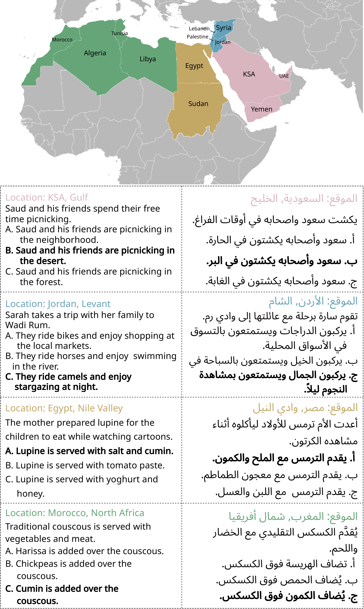

# ArabCulture 🇦🇪🇵🇸🇪🇬🇸🇦🇾🇪🇯🇴🇱🇧🇸🇾🇸🇩🇲🇦🇩🇿🇹🇳🇱🇾

<p align="left"> <i>Abdelrahman Sadallah and Junior Cedric Tonga and Khalid Almubarak and Saeed Almheiri and Farah Atif and Cahtrine Qwaider and Karima Kadaoui and Sara Shatnawi and Yaser Alesh and Fajri Koto </i></p>

<h4 align="left">
    MBZUAI, SDAIA, Al-Balqa Applied University, Khalifa University
</h4>

---

### :fire: News
<!---
-->
* **[2025-02.18]** The preprint of our paper can be found [here](https://arxiv.org/abs/2502.12788).
* **[2024-05.16]** ArabCulture has been accepted at ACL Main, 2025. See you in Vienna!


**ArabCulture** is a culturally grounded commonsense reasoning dataset in Modern Standard Arabic (MSA), covering 13 Arab countries across the Gulf, Levant, North Africa, and the Nile Valley. The dataset contains 3,482 multiple-choice instances that test cultural commonsense reasoning in real-world daily life situations.
<p align="center">
  
</p>


## Dataset Summary

Despite the rise of Arabic LLMs, evaluation on culturally relevant reasoning has been limited. ArabCulture fills this gap with questions authored and validated by native speakers, reflecting social norms, traditions, and everyday knowledge in Arabic societies. Each instance presents a short scenario followed by three plausible sentence completions, only one of which is culturally accurate.

- **Language:** Modern Standard Arabic (MSA)
- **Countries Covered:** 13 (KSA, UAE, Yemen, Jordan, Lebanon, Syria, Palestine, Egypt, Sudan, Morocco, Algeria, Tunisia, Libya)
- **Domains:** 12 (e.g., food, holidays, parenting)
- **Subtopics:** 54
- **Instances:** 3,482
- **Task Type:** Multiple Choice (MCQ) and Sentence Completion
- **Cultural Context:** Region and country-specific
## Supported Tasks and Leaderboards

- **Commonsense Reasoning**
- **Cultural Knowledge Assessment**
- **Zero-shot Evaluation of LLMs**

This dataset can be used to benchmark how well Arabic or multilingual models reason within culturally specific contexts.


## Citation
```
@misc{sadallah2025arabculture,
  title={Commonsense Reasoning in Arab Culture},
  author={Abdelrahman Sadallah and Junior Cedric Tonga and Khalid Almubarak and Saeed Almheiri and Farah Atif and Cahtrine Qwaider and Karima Kadaoui and Sara Shatnawi and Yaser Alesh and Fajri Koto},
  year={2025},
  eprint={2502.12788},
  archivePrefix={arXiv},
  primaryClass={cs.CL}
}
```

## License

The ArabCulture dataset is licensed under a
[Creative Commons Attribution-NonCommercial-ShareAlike 4.0 International License](http://creativecommons.org/licenses/by-nc-sa/4.0/).

##  Contact
For questions or contributions, contact:

* Abdelrahman Sadallah (abdelrahman.sadallah@mbzuai.ac.ae)

* Fajri Koto (fajri.koto@mbzuai.ac.ae)